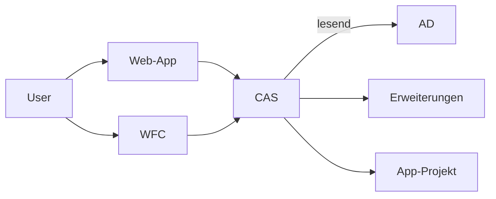

# Minova Open Source Dokumentation

* **Zur Zeit lassen sich einige Projekte nicht bauen, da einige Abhängigkeiten privat sind. Siehe link:[#1](https://github.com/minova-afis/aero.minova.os.doc/issues/1).**

* **Öffentliche Projekte sollten keinerlei Verweise oder Infos bezüglich der internen Infrastruktur der Minova beinhalten.**

## Dienste, Programme und Standards

* [CAS](https://github.com/minova-afis/aero.minova.core.application.system) - Schnittstelle zu Daten und Prozeduren
* [WFC](https://github.com/minova-afis/aero.minova.rcp) - Der Standard RCP Fatclient von MINOVA
* [XSD](https://github.com/minova-afis/aero.minova.xsd) - Öffentliche XML-Schemata
* [OS-Build](https://github.com/minova-afis/aero.minova.os.build) - Baut alle OS-Projekte
* [Maven-Parent](https://github.com/minova-afis/aero.minova.maven.parent) - Grundkonfiguration für alle Maven-Projekte

## Infrastruktur

* [p2-Repository für WFC](https://github.com/minova-afis/aero.minova.rcp.updatesite)
* [Public Docker Registry](https://hub.docker.com/u/minova)
